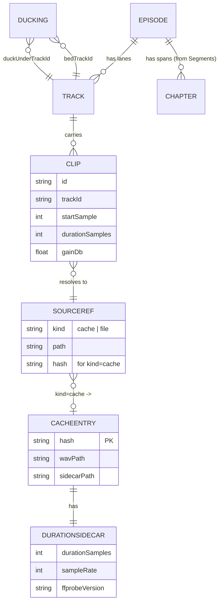
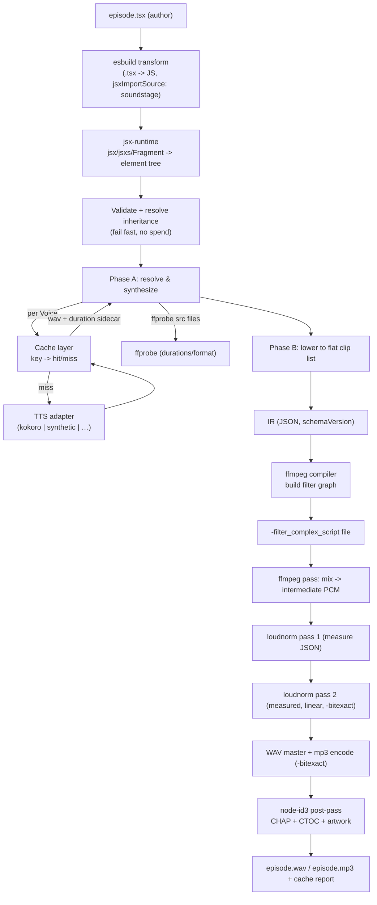

# Technical Architecture: Soundstage v0.1 (the deterministic spine)

## 1. Overview

Soundstage is an OSS TypeScript tool for authoring **narrated audio episodes as code**. A podcast or narrated episode is written as a JSX/TSX file, lowered to a stable **intermediate representation (IR)**, and **deterministically rendered to audio via ffmpeg** — no browser, no DAW, no reconciler. The author writes composition; Soundstage owns the assembly math (resampling, sample-accurate placement, crossfades, sidechain ducking, EBU R128 loudness normalization, chapter metadata) — exactly the part that humans and LLMs reliably get wrong by hand-writing `filter_complex` graphs.

Soundstage produces **no audio of its own**. Speech is synthesized at render time by a pluggable, provider-agnostic TTS adapter (default: local Kokoro, zero API keys); existing audio (beds, jingles, recorded clips) is referenced by `src` and mixed in. A **content-hash cache** sits in front of synthesis: edit one line of narration and only that unit re-synthesizes; everything else is served from cache. The cache is also the **determinism boundary** — see §8.

This document is the implementation contract for v0.1: the **deterministic spine**, rendering end-to-end from `episode.tsx` to a WAV master + mp3 with chapters. It is written for a solo/indie maintainer: a single npm package, no server, no managed infrastructure, hermetic CI. Scope is deliberately narrow — the spine must be correct and stable before any breadth (more components, more adapters) is added.

**Architectural goals**

1. **Determinism** — byte-identical WAV master from the same cache + pinned ffmpeg (precise claim in §8).
2. **A stable IR contract** — the compiler knows nothing about JSX or TTS providers; the IR is the only thing it consumes.
3. **A trivially extensible adapter seam** — adding a cloud TTS (or, later, music generation) provider must not touch the IR or compiler.
4. **Correctness over features** — every documented ffmpeg footgun is pinned by a golden test.
5. **Zero-friction onboarding** — `npx soundstage render episode.tsx` works with no keys and no config.

**Constraints**

- Single Node package, runs as both a CLI and a library.
- ffmpeg/ffprobe are external binaries invoked as child processes (assume v8.x present on PATH; version is detected and recorded).
- CI must be hermetic — no model download, no network — via a synthetic TTS adapter.

---

## 2. Tech Stack

| Concern | Choice | Why | Alternatives considered |
|---|---|---|---|
| Language | **TypeScript, `strict`** | Type-checked IR/adapter contracts are the whole value of a stable spine; `strict` catches the null/undefined classes early. | Plain JS (rejected: the IR contract is too load-bearing to leave untyped). |
| Module system | **ESM, `"type": "module"`** | Node v24 native ESM; aligns with `jsxImportSource` automatic runtime resolution and modern tooling. | CJS (rejected: friction with jsx-runtime resolution and modern deps). |
| `.tsx` loading at runtime | **esbuild** (programmatic `transform`) | We must transpile arbitrary user `.tsx` *in-process* at CLI runtime; esbuild is a fast, single-dependency transformer with first-class `jsxImportSource`/automatic-runtime support and no config file. See §10 for the full mechanism. | `tsx`/`jiti` (rejected: heavier loaders that hijack module resolution globally; we want a scoped, explicit transform we control). `ts-node` (rejected: slow, tsconfig-coupled). Pure `tsc` (rejected: not a runtime loader). |
| JSX runtime | **Custom automatic jsx-runtime** (`jsxImportSource: 'soundstage'`) | We need an element tree, not a DOM or a reconciler. A ~30-line `jsx`/`jsxs`/`Fragment` is all that's required; no React dependency, no diffing, no browser. | React + custom renderer (rejected: reconciler is pure accidental complexity for a one-shot tree). |
| Audio engine | **ffmpeg + ffprobe** (external binaries, child process) | ffmpeg is *the* audio renderer — saturated in training data, correct, ubiquitous; we orchestrate it rather than reimplement DSP. Invoked via `-filter_complex_script` files. | WebAudio/OfflineAudioContext (rejected: needs a browser, non-deterministic across engines). Native DSP libs (rejected: reinventing ffmpeg, non-deterministic, huge surface). |
| ffmpeg invocation | **`node:child_process` `execFile`** (no wrapper lib) | Direct control over argv, exit codes, and the `-filter_complex_script` file path; wrapper libraries obscure the exact command (which we must print and golden-test). | `fluent-ffmpeg` (rejected: stalled maintenance, abstracts away the exact graph we need to control and verify). |
| Default TTS | **Kokoro via `kokoro-js`** (`onnx-community/Kokoro-82M-v1.0-ONNX`, `dtype:"q8"`) | Keyless, local, fast (~1.4s/synth), 24kHz mono, verified byte-deterministic on the reference machine. Makes `npx … render` work with zero setup. | Cloud-only default (rejected: API-key wall kills onboarding). |
| Kokoro dependency shape | **optional `peerDependency` + lazy `import()`** | The model + onnxruntime are heavy (~86MB model, native runtime); users who supply their own adapter or use synthetic shouldn't pay for it. Loaded only when the Kokoro adapter is first invoked. | Hard `dependency` (rejected: bloats install, forces native build on every user). |
| Test TTS | **Synthetic tone adapter** (in-repo) | Deterministic text→tone with a real ffprobe duration sidecar; gives hermetic CI + stable golden fixtures with no model download or network. | Mocking Kokoro (rejected: mocks drift from the real adapter contract; a real adapter exercising the real seam is safer). |
| Chapters | **`node-id3`** post-pass | ffmpeg writes CHAP but omits the CTOC frame for mp3 (trac #7940); a post-pass guarantees navigable chapters regardless of ffmpeg version. | ffmpeg FFMETADATA only (rejected: CTOC unreliable across pinned versions — see §5.6). |
| Test runner | **Vitest** | First-class ESM + TS, fast, snapshot support for golden assertions, good watch DX for a solo dev. | Jest (rejected: ESM friction, slower). node:test (rejected: thinner snapshot/fixture ergonomics). |
| CLI framework | **`commander`** | Mature, tiny, declarative subcommands/flags; enough for `render` + flags without a framework. | `yargs` (rejected: heavier API). oclif (rejected: framework overkill for one command). Hand-rolled (rejected: flag parsing is a footgun better delegated). |
| Lint/format | **ESLint (flat) + Prettier** | Standard, low-friction, keeps the public OSS surface consistent for contributors. | Biome (viable; rejected only for ecosystem familiarity — revisit if tooling speed matters). |
| Error tracking / monitoring | **None (CLI)** | A local CLI has no server to monitor; failures surface as non-zero exit codes + structured stderr. Telemetry is explicitly out of scope for an OSS dev tool (privacy + trust). | Sentry et al. (rejected: no server, telemetry would be a trust cost with no benefit). |

There is **no database, no auth, no hosting, no payments** in v0.1 — this is a local CLI/library. The "data model" is the IR (§3); the "API" is the component DSL + adapter interface + CLI surface (§4).

---

## 3. Data Model — The Intermediate Representation (IR)

The IR is the **stable neutral contract** between the front half (JSX → resolved tree) and the back half (compiler → ffmpeg). It is the most important artifact in the system: the compiler consumes *only* the IR and must know nothing about JSX or which TTS provider ran. The IR is plain serializable JSON (logged with `--draft` introspection, golden-tested, and stable enough that external projects can target it in future).

### 3.1 Two-phase construction

The IR is built in two phases, because **clip placement requires real audio durations**, and a synthesized `<Voice>`'s duration is only known after synthesis:

- **Phase A — Resolve & synthesize.** Walk the element tree top-down, applying inherited props (§ Open Decision 1). For every `<Voice>` node, derive its **cache key**, check the cache, synthesize on miss, and record the **real duration** (from the cache's duration sidecar — never estimated). For `<Clip>`/`<MusicBed src>`, probe the source file's duration/format via ffprobe (also cached by file path + mtime + size). The output of Phase A is a **resolved tree**: every leaf has a concrete `sourceRef` and `durationSamples`.
- **Phase B — Lower to a flat clip list.** Walk the resolved tree, converting the nested composition (sequential siblings, music beds under children, crossfades) into a **flat, sample-domain clip list** with absolute start positions, plus chapter spans. This is the IR the compiler consumes.

Phase A is the only phase that touches TTS, the cache, and the network. Phase B and the compiler are pure functions of (resolved tree) → (IR) → (ffmpeg script): fully deterministic and unit-testable without any synthesis.

### 3.2 IR schema (v0.1)

All time/positions are in **integer samples** at the master sample rate (`sampleRate`, default 48000). Samples — not seconds — are the unit throughout the IR and compiler, because float seconds accumulate rounding error over a long episode and break sample-accurate placement and determinism. Gains are in **dB** (float; canonicalized — see §4.5). Fades are durations in **samples**.

```jsonc
{
  "schemaVersion": 2,              // bumped on any IR-shape or cache-key change → invalidates cache
  "sampleRate": 48000,             // master rate; all sample positions are at this rate
  "channels": 1,                   // v0.1 is mono end-to-end (Kokoro is mono); stereo is a later phase
  "episode": {
    "title": "Grafex weekly #12",
    "author": "André",             // optional
    "artwork": "cover.png"         // optional; embedded by the node-id3 post-pass
  },
  "tracks": [                      // logical mix lanes; trackId is referenced by clips
    { "trackId": "voice" },        // sequential narration + clips lane
    { "trackId": "bed-0" }         // one lane per MusicBed instance
  ],
  "clips": [
    {
      "id": "c0",                  // stable, deterministic id (assigned in tree order)
      "sourceRef": {               // discriminated union — compiler resolves to an input file
        "kind": "cache",           // "cache" | "file"
        "path": ".soundstage/cache/<hash>.wav",
        "hash": "<sha256>",        // present for kind:"cache"; used in the cache report
        "voiceUnitId": 3,           // back-ref to the Voice node for per-segment reporting (integer index)
      },
      "trackId": "voice",
      "startSample": 0,            // absolute position on the master timeline
      "durationSamples": 211200,   // real measured duration (post-trim)
      "gainDb": 0.0,
      "trim": { "startSample": 0, "endSample": 211200 }, // optional; applied via atrim
      "fades": {                   // optional; sample-domain
        "in":  { "durationSamples": 0,    "curve": "tri" },
        "out": { "durationSamples": 0,    "curve": "tri" }
      },
      "loop": true,                // optional (bed clips only); T8b realizes via ffmpeg `aloop` filter
      "crossfadeIntoNext": {       // optional; set when a <Crossfade> separates this clip from the next sibling
        "durationSamples": 36000,  // 0.75s @ 48k
        "curve": "tri"
      }
    }
  ],
  "ducking": [                     // one entry per MusicBed that has children
    {
      "bedTrackId": "bed-0",
      "duckUnderTrackId": "voice", // the bed ducks under this lane's content
      "reductionDb": -12,          // MusicBed.duck
      "preset": "speech-v1"        // sidechaincompress attack/release/threshold/ratio preset id (pinned)
    }
  ],
  "chapters": [                    // from <Segment> spans; sample-domain, converted to ms in the post-pass
    { "title": "Intro", "startSample": 0,      "endSample": 480000 },
    { "title": "Outro", "startSample": 480000, "endSample": 960000 }
  ],
  "loudness": {                    // applied as a SEPARATE measured two-pass after the mix (never in-graph)
    "targetI": -16.0, "targetTP": -1.5, "targetLRA": 11.0
  },
  "render": {
    "ffmpegVersion": "8.1.1",      // detected at render; recorded for the determinism claim
    "outputs": ["wav", "mp3"]
  }
}
```

### 3.3 Entity relationships



**Indexes / lookups worth noting**

- The cache is content-addressed: the only "index" is the filename = `{hash}.wav`. Lookup is an O(1) `fs.access`.
- ffprobe results for `kind:"file"` sources are memoized in-process by `(absPath, mtimeNs, size)` to avoid re-probing the same file across clips.

**Phase markers.** Every entity above is **Phase 1**. Future-phase additions (stereo `channels:2`, multiple beds layered, per-clip EQ, music-gen sources) extend this schema additively behind `schemaVersion` bumps — see §10.

**No soft delete.** The IR is a build artifact regenerated on every render; there is no persistent mutable state to soft-delete. The only on-disk state is the content-addressed cache, which is purely additive (entries are immutable; "deletion" is a cache prune, never a logical delete).

---

## 4. API Design

Soundstage exposes three "API" surfaces, none of which is an HTTP API:

1. **The component DSL** (what authors write in `.tsx`) — §4.1–4.3.
2. **The TTS adapter interface** (the extension seam) — §4.4.
3. **The cache** (content-hash contract) — §4.5.
4. **The CLI** — §6.

There is **no network API** in v0.1, so there is no auth, rate limiting, or versioning of HTTP endpoints. "Versioning" applies to the IR and cache (`schemaVersion`, §4.5). "Validation" applies to component props and adapter outputs (below). "Error format" is structured stderr + non-zero exit codes (§4.6).

### 4.1 Component catalog (v0.1)

| Component | Props | Semantics |
|---|---|---|
| `<Episode>` | `title` (req), `author?`, `artwork?`, `sampleRate=48000` | Root. Establishes master rate/metadata. Children play **sequentially**. |
| `<Segment>` | `title?`, *(+ inheritable Voice defaults — see §4.3)* | Logical chapter. Its `title` becomes a chapter spanning its rendered children. Children play sequentially. |
| `<Voice>` | `voice` (req), `provider?`, `speed?`, *(text children)* | **The cached unit.** Text content is synthesized by the selected adapter. One `<Voice>` = one cache entry = one TTS call. |
| `<MusicBed>` | `src` (req), `duck=-12`, `fadeIn?`, `fadeOut?`, `loop?` | Plays **under** its children (sidechain-ducked). Its duration is stretched/looped to cover the children's total duration. |
| `<Clip>` | `src` (req), `gain?`, `trim?` | References existing audio, mixed into the sequential lane at its position. |
| `<Silence>` | `duration` (req, seconds) | Inserts a gap of exact duration in the sequential lane. |
| `<Crossfade>` | `duration=0.75` (seconds) | A **separator** between two sibling clips: overlaps them by `duration` with an equal-power crossfade. Has no audio of its own. |

### 4.2 Composition rules

- **Siblings play sequentially.** A parent's children are concatenated head-to-tail on the timeline. Each child's `startSample` = sum of prior siblings' `durationSamples` (minus crossfade overlaps).
- **`<MusicBed>` overlays its children.** The bed is placed on its own `bed-N` track spanning `[firstChild.start, lastChild.end]`, ducked under the `voice` lane content per the `ducking` entry. `fadeIn`/`fadeOut` apply to the bed; `loop` repeats the source to fill the span; otherwise the bed is trimmed or (if shorter) padded with silence.
- **`<Crossfade>` consumes its neighbors.** A `<Crossfade duration={d}>` between clip A and clip B sets `A.crossfadeIntoNext = {d}`, shifting B's start earlier by `d` and overlapping the two with `acrossfade`. A `<Crossfade>` at a boundary with no preceding or following clip is a validation error.
- **`<Segment>` is a span, not a mixer.** It does not alter audio; it only (a) cascades inheritable defaults to descendants (§4.3) and (b) emits a chapter covering its rendered children.

### 4.3 Prop inheritance (resolved — see Open Decision 1)

`<Segment>` (and `<Episode>`) **may carry Voice defaults** (`voice`, `provider`, `speed`) that **cascade to descendant `<Voice>` nodes**. A `<Voice>` that omits a prop inherits the nearest enclosing ancestor's value; an explicit prop on `<Voice>` overrides. This keeps episodes terse and LLM-friendly (set the host once per segment). Inheritance is **resolved before cache-key derivation**, so the cache key always reflects the *effective* (post-inheritance) settings — two `<Voice>`s with identical effective settings + text share a cache entry regardless of where the value was declared. See §11 for full semantics.

### 4.4 TTS adapter interface (the extension seam)

The adapter is the only place that knows about a TTS provider. The IR and compiler never import an adapter. Adapters are pure async functions of a request → audio bytes + metadata; **identity and settings serialization are part of the contract** because they feed the cache key.

```ts
interface TtsAdapter {
  /** Stable provider identity, part of the cache key. e.g. "kokoro", "synthetic", "openai". */
  readonly id: string;

  /** Model identifier, part of the cache key. e.g. "Kokoro-82M-v1.0-ONNX-q8". */
  readonly model: string;

  /**
   * Canonicalize provider-specific settings into a deterministic, stable object that
   * is JSON-serialized into the cache key. MUST be order-independent and float-stable
   * (see §4.5). Anything that changes the audio MUST appear here; anything that does
   * not (e.g. a request timeout) MUST NOT.
   */
  canonicalSettings(req: SynthRequest): Record<string, unknown>;

  /**
   * Synthesize. Returns 24k/48k mono PCM as raw samples plus the true sample count.
   * The adapter does NOT touch the cache or the filesystem — the cache layer wraps it.
   */
  synth(req: SynthRequest): Promise<SynthResult>;
}

interface SynthRequest {
  text: string;          // normalized text (see §4.5)
  voice: string;         // effective voice id (post-inheritance)
  speed?: number;        // effective speed
  sampleRate: number;    // requested PCM rate (adapter may return native; cache records actual)
}

interface SynthResult {
  pcm: Float32Array;     // mono, interleaved-N/A (1 ch); f32le
  sampleRate: number;    // ACTUAL rate of pcm (e.g. 24000 for Kokoro)
  durationSamples: number; // = pcm.length (at sampleRate)
}
```

**Available adapters**

- **Kokoro** (`id:"kokoro"`, default for `--final`) — lazy `import('kokoro-js')`, `dtype:"q8"`, returns 24kHz mono f32. `canonicalSettings` = `{ speed }`. Keyless, local, no API cost.
- **OpenAI** (`id:"openai"`, `--provider openai`) — native `fetch` to `POST /v1/audio/speech`, `response_format:"pcm"`, returns raw int16 PCM at 24kHz, 1 ch, converted to f32 on receipt. Model is a constructor parameter (default `"tts-1"`; `"tts-1-hd"` also supported — model is part of the cache key, so the two produce independent entries). `canonicalSettings` = `{ speed }`. API key from `OPENAI_API_KEY` env var at synth() call time. No SDK peer dep — single REST endpoint. Retries on HTTP 429/5xx via the shared `withRetry` utility (`src/adapters/cloud/retry.ts`).
- **Synthetic** (`id:"synthetic"`, test fixture) — text → deterministic tone whose frequency/duration are derived from a hash of the text (so different text → different, stable audio), returned with a real sample count. Used by CI and golden tests; **needs no model and no network**.

**Adapter selection (CLI `--provider` flag):**

```
--draft                       → synthetic adapter (ignores --provider; warns if set)
--final                       → kokoro (default, backward-compat)
--final --provider kokoro     → kokoro (explicit)
--final --provider openai     → OpenAI TTS (requires OPENAI_API_KEY)
--final --provider elevenlabs → ElevenLabs TTS (coming soon; requires ELEVENLABS_API_KEY)
```

Error codes:
- `E_ADAPTER_MISSING_KEY` (exit 2) — required API key env var is absent at synth() call time.

**Cloud extensibility:** adding a new cloud TTS provider requires only implementing `TtsAdapter` and registering it in `selectAdapter()`. The IR, compiler, and cache are untouched. Provider quirks (char limits, sentence chunking, request-stitching) live entirely inside the adapter and must be folded into `canonicalSettings` so the cache key stays correct.

### 4.5 Content-hash cache (the durable mechanism)

The cache is the heart of Soundstage's value: an edit re-synthesizes only the changed `<Voice>`, and (with a pinned cache) the same source renders byte-identically.

**Granularity (resolved — see Open Decision 2):** the cache is keyed **per-`<Voice>`** — one TTS call = one cache entry. The **cache report** is rolled up **per-`<Segment>`** for human readability (e.g. `Intro: 2/2 cached · Topic 2: 1/3 re-synth`).

**Key derivation:**

```
key = sha256( canonicalJSON({
  schemaVersion,          // bump invalidates the whole cache
  adapterId,              // adapter.id
  model,                  // adapter.model
  voice,                  // effective voice (post-inheritance)
  settings,               // adapter.canonicalSettings(req)  (already canonical)
  text,                   // normalized text (below)
  format                  // { sampleRate, sampleFmt: "f32le", channels: 1 }
}) )
```

**Canonicalization rules (each is a correctness footgun → each gets a golden/unit test):**

- **Canonical JSON:** keys sorted lexicographically, no insignificant whitespace, UTF-8, no trailing zeros ambiguity (numbers serialized via the float rule below). A single shared `canonicalJSON()` is used for *both* the cache key and any IR comparison.
- **Float serialization:** all floats (e.g. `speed`, `gainDb`) are serialized with a fixed format — round to 6 decimal places, strip trailing zeros, render `-0` as `0`, forbid `NaN`/`Inf`. This prevents `1.1` vs `1.10000001` cache misses.
- **Text normalization:** Unicode NFC, normalize CRLF→LF, collapse runs of horizontal whitespace, trim. (Note: this is the *cache-key* normalization; the adapter receives the same normalized text so audio matches the key.)
- **APFS case-insensitivity hazard:** sha256 hex is lowercase-only, so `{hash}.wav` filenames never collide case-wise on case-insensitive filesystems. Any case-bearing component (e.g. a `voice` id) is **lowercased before hashing** *and* the hash itself is the only thing that ever becomes a filename — so the default macOS case-insensitive APFS cannot alias two distinct keys to one file.

**On-disk layout (per project, gitignorable):**

```
.soundstage/
  cache/
    <hash>.wav          # mono f32le @ the cached rate (24000 for Kokoro)
    <hash>.json         # duration sidecar: { durationSamples, sampleRate, sampleFmt, channels,
                        #                      ffprobeVersion, adapterId, model, createdAt }
```

- **Cache format (resolved — see Open Decision 5):** stored as **f32le** (matching Kokoro's native output) to avoid a quantization round-trip on cache write; conversion to the 48k master happens once, in the compiler, on every input edge. The duration sidecar is **JSON** carrying the real ffprobe-measured `durationSamples` (load-bearing: Phase B layout needs durations *before* the compiler runs, and re-probing on every render is wasteful).
- **Hit:** sidecar present + wav present → use directly, record `cached` in the report.
- **Miss:** call adapter → write `{hash}.wav` (atomic: write to `{hash}.wav.tmp`, ffprobe it, write sidecar, then rename) → record `re-synth`.
- **`--no-cache`:** bypass read (always re-synth) but **still write** entries (so a later run benefits). A future `--no-cache-write` could disable writes; out of scope for v0.1.

### 4.6 Error format

CLI errors are structured to stderr and map to non-zero exit codes:

```
soundstage: error[E_CROSSFADE_BOUNDARY]: <Crossfade> at episode.tsx must sit between two clips
  at <Segment title="Intro"> → child index 0
```

- `exit 1` — user/composition error (bad props, crossfade at a boundary, missing `src` file).
- `exit 2` — adapter/synthesis error (model load failed, provider error).
- `exit 3` — ffmpeg/ffprobe error (non-zero exit; the failing command and its stderr tail are surfaced).
- Validation runs as a pass over the resolved tree *before* any synthesis, so composition errors fail fast and free (no wasted TTS spend).

---

## 5. System Architecture

### 5.1 Component diagram



### 5.2 Critical user journeys

**Journey 1 — first render (cold cache).**
`npx soundstage render episode.tsx` → esbuild transforms the file → jsx-runtime builds the tree → validate + resolve inheritance → Phase A synthesizes every `<Voice>` (all misses; Kokoro loads once, ~2.5s, then ~1.4s/synth), writing `{hash}.wav` + sidecar; ffprobe measures `<Clip>` sources → Phase B lowers to IR → compiler emits the filter script → ffmpeg mixes → two-pass loudnorm → encode → node-id3 chapters → `episode.wav`/`episode.mp3`. Report: `N/N re-synth`.

**Journey 2 — edit one segment (warm cache, the money shot).**
Author changes one `<Voice>`'s text. Re-run `render`. Every other `<Voice>`'s effective settings + text are unchanged → identical key → **cache hit**; only the edited unit is a miss → one TTS call. The rest of the pipeline runs identically. Report: `Intro: cached · Topic 2: 1/3 re-synth · Outro: cached`, with the cost framing the cache enables.

**Journey 3 — ducked music bed.**
`<MusicBed src="theme.mp3" duck={-12}>` wrapping segments → Phase B places `theme.mp3` on `bed-0` spanning the children and emits a `ducking` entry → compiler builds the sidechain topology (§5.4) so the bed automatically dips ~12 dB under narration and recovers in the gaps.

### 5.3 ffmpeg compiler — overview (the hard 30%)

The compiler is a **pure function `IR → filter-script string + argv`**. It runs ffmpeg in up to three invocations:

1. **Mix pass** — build the full graph, render to an **intermediate PCM** master (`pcm_f32le`, master rate). No loudness here.
2. **Loudnorm measure pass** — run `loudnorm` in *analysis* mode on the intermediate to get the measured JSON (`measured_I/TP/LRA/thresh/offset`).
3. **Loudnorm apply + encode pass** — run `loudnorm` again with the measured values + `linear=true` + explicit `-ar`, then `-bitexact` encode to WAV and mp3.

Loudness is **never** done per-segment and **never** inside the mix graph — only once, measured, after the full mix. This is the single most common loudness footgun and is pinned by a golden test.

**Universal input conditioning.** Every input edge (cache wav, clip, bed) gets, unconditionally:

```
aresample=48000:resampler=soxr, aformat=sample_fmts=fltp:channel_layouts=mono:sample_rates=48000
```

Resampling on *every* edge (even already-48k inputs) keeps the graph uniform and removes a whole class of "this one input was a different rate/format" bugs. Kokoro's 24kHz cache audio is upsampled here, once.

### 5.4 Filter topology (sketch)

For a sequence of voice/clip nodes on the `voice` lane with one ducking bed:

```
# ---- condition every input ----
[0:a] aresample=48000:resampler=soxr, aformat=sample_fmts=fltp:channel_layouts=mono [v0];
[1:a] aresample=48000:resampler=soxr, aformat=fltp:channel_layouts=mono [v1];
[2:a] aresample=48000:resampler=soxr, aformat=fltp:channel_layouts=mono [bed_raw];

# ---- place voice-lane clips: trim + position in SAMPLES ----
[v0] atrim=start_sample=0:end_sample=211200, asetpts=PTS-STARTPTS [v0p];
[v1] adelay=delays=211200S:all=1 [v1p];          # 'S' suffix = samples
# ... acrossfade pairs serialized where a <Crossfade> exists ...
[v0p][v1p] acrossfade=ns=36000:c1=tri:c2=tri [voicelane];   # ns = samples

# ---- bed: fade + loop/trim to span, then duck under the voice lane ----
[bed_raw] aloop=…, atrim=…, afade=in:…, afade=out:… [bed];
[voicelane] asplit=2 [vc_mix][vc_key];           # one copy mixes, one copy keys the compressor
[bed][vc_key] sidechaincompress=threshold=…:ratio=…:attack=…:release=…:makeup=1 [bed_ducked];

# ---- mix with EXPLICIT pre-gains, no auto-normalize ----
[vc_mix]    volume=0dB [vc_g];
[bed_ducked] volume=-12dB [bed_g];               # MusicBed.duck as the bed's resting level
[vc_g][bed_g] amix=inputs=2:normalize=0:dropout_transition=0 [mix]
```

Key decisions baked in:

- **Sample-domain placement** (`atrim=…_sample`, `adelay=…S`, `acrossfade=ns=…`) — never float seconds — for sample-accurate, deterministic positioning.
- **`acrossfade` serialization** — crossfades are pairwise; a chain of N clips with crossfades is folded left-to-right into one lane.
- **Ducking via `asplit` → `sidechaincompress` → `amix normalize=0`** — the voice lane is split: one copy is mixed, one copy keys the compressor on the bed. `amix normalize=0` with **explicit per-input `volume`** pre-gains prevents ffmpeg's auto-normalization from silently changing levels (a documented footgun).
- **`sidechaincompress` preset** — attack/release/threshold/ratio are a *pinned preset* (`speech-v1`, ~250–500ms release), recorded in the IR's `ducking[].preset`. (Tuning the preset by ear is a build task, not an architecture decision; the architecture only fixes *that it is a named, pinned, IR-recorded preset*.)
- **`-filter_complex_script <file>`** — the graph is written to a file and passed by path, not as an argv string. Long episodes blow past argv length limits and shell-quoting is a footgun; a script file sidesteps both and is also the exact artifact golden tests diff.

### 5.5 Two-pass loudnorm (exact)

```
# pass 1 — measure (analysis only)
ffmpeg -i mix.f32.wav -af loudnorm=I=-16:TP=-1.5:LRA=11:print_format=json -f null -   # parse measured_*

# pass 2 — apply with measured values + linear + explicit rate, bit-exact
ffmpeg -bitexact -i mix.f32.wav \
  -af loudnorm=I=-16:TP=-1.5:LRA=11:measured_I=<>:measured_TP=<>:measured_LRA=<>:measured_thresh=<>:offset=<>:linear=true:print_format=summary \
  -ar 48000 -bitexact master.wav
```

`linear=true` + measured values force the deterministic linear path (the dynamic fallback is non-deterministic and is what breaks naive single-pass loudnorm). `-ar` is set explicitly because loudnorm resamples internally and an implicit rate is another footgun.

### 5.6 Chapters (CHAP + CTOC)

ffmpeg writes CHAP frames from FFMETADATA but **omits the CTOC frame for mp3** (trac #7940; even where a recent ffmpeg commit addresses it, behavior varies across pinned versions, so we do not depend on it). After encoding, a **`node-id3` post-pass** writes CHAP **and** CTOC (and embeds `artwork`) from the IR's `chapters[]` (sample positions → ms). This guarantees navigable chapters in podcast players regardless of which pinned ffmpeg is present. The post-pass is the *only* place chapters are written; ffmpeg's `-map_metadata` chapter path is not used for mp3.

### 5.7 Background jobs / async

None. Everything is a single synchronous CLI invocation. Synthesis calls are `await`ed sequentially in Phase A (parallelism across `<Voice>` nodes is a possible future optimization but is intentionally deferred — sequential keeps determinism reasoning and Kokoro's single model instance simple).

---

## 6. Infrastructure & Deployment

This is a **published npm package + a binary on the user's machine** — there is no server, no cloud, no environments-as-infrastructure.

- **Distribution:** published to npm (MIT). Runs via `npx soundstage render …` or installed locally. ffmpeg/ffprobe are a documented prerequisite (detected at startup with a clear error + install hint if missing).
- **"Environments":** the only meaningful split is **local dev** (the maintainer's machine + CI) vs **end-user machine**. There is no staging/prod because there is no deployed service.
- **CI/CD (GitHub Actions):** two workflows. `ci.yml` runs on every PR/push: typecheck, lint, build, and the full test suite via the synthetic adapter only (`NO_KOKORO=1`) — hermetic, no model download, no network. `release.yml` triggers on tags (`v*`): a **test job** (same hermetic suite) runs first; the **publish job** (`needs: test`) runs only if tests pass and calls `npm publish --provenance`. The Kokoro path is never on the CI hot path.
- **Artifact integrity:** ffmpeg/ffprobe version is detected and recorded in the IR and the rendered file's metadata, so a determinism claim is always qualified by the exact binary used.
- **Cost (Phase 1):** effectively **$0 recurring.** No hosting. The only optional cost is end-user cloud-TTS API spend if they opt into a cloud adapter — borne by the user, with their own keys, and *minimized by the cache*. Domain (`soundstage.sh`) is a one-time ~$30/yr for docs/landing, not infrastructure.
- **Backups / data:** the only persistent state is the user's local content-addressed cache, which is a derived artifact (regenerable from source + adapter) — no backup strategy is needed beyond "it's reproducible." The source of truth is the user's `.tsx` in their own VCS.
- **CDN:** n/a (no served assets in v0.1; docs site, if any, is static-hostable).
- **Scaling path:** the package itself doesn't "scale" — it's a local tool. The relevant scaling axes are (a) **long episodes** → the filter-script-file + sample-domain design already handles graphs too large for argv; if a single monolithic ffmpeg graph becomes too large/slow, the next step is **segment-wise intermediate renders concatenated bit-exactly** (deferred, not needed for v0.1-scale episodes); (b) **synthesis throughput** → optional parallel synthesis across `<Voice>` nodes; (c) a future **hosted renderer** is an entirely separate service that would consume the same IR — the IR contract is what makes that possible without rewriting the spine.

---

## 7. Authentication & Authorization

**Not applicable in the traditional sense — there is no server, no user accounts, no multi-tenant data.** Soundstage v0.1 is a local CLI/library. The security model is therefore about **safe execution and credential handling**, not authn/authz:

- **Credentials:** cloud TTS adapters (post-v0.1) read API keys **only** from environment variables (`OPENAI_API_KEY`, `ELEVENLABS_API_KEY`, …). Keys are never read from the `.tsx`, never written to the cache, never logged, and never embedded in cache keys (only the *settings that affect audio* are). The default Kokoro path needs no keys at all.
- **Executing user code:** `episode.tsx` is transformed and executed in-process. This is the same trust model as any config-as-code tool (a `vite.config.ts`, a webpack config) — the user runs their own code. We do **not** sandbox it (that would be security theater for a tool you run on your own files), but we **document** that `render` executes the file, and we never auto-execute files we fetch.
- **Filesystem boundaries:** the cache and outputs are written under the project dir / an explicit `--out`; the tool never writes outside the working tree without an explicit path.
- **Input validation:** all component props are validated against the schema before synthesis; `src`/`artwork` paths are resolved and existence-checked; ffmpeg is invoked via `execFile` with an **argv array (never a shell string)**, so there is no shell-injection surface from user-controlled `title`/`src`/`text` values. The `-filter_complex_script` file means user text/titles never land on a command line.
- **Dependency supply chain:** minimal dependency surface (esbuild, commander, node-id3, vitest-dev-only; kokoro-js optional); npm publish with provenance; lockfile committed.

CSRF/XSS/session/password/OAuth concerns are all **n/a** (no web surface, no sessions, no accounts). If a hosted offering is ever built, it is a separate service with its own auth design and is explicitly out of scope here.

---

## 8. Determinism (the central guarantee)

**The precise, honest claim:**

> Given the **same cache** and a **pinned ffmpeg/ffprobe version**, Soundstage produces a **byte-identical WAV master** from the same source. The mp3 is reproducible but is the lossy/encoded layer; the WAV master is the canonical byte-identical artifact.

**What is forbidden to claim:** "reproducible voices." Hosted TTS providers are not byte-reproducible (best-effort or no seed; voice models drift between vendor updates). Kokoro-local has been observed byte-deterministic on the reference machine but this is environment-dependent and is **not** promised as a cross-machine guarantee.

**Why the cache is the determinism boundary.** Synthesis is the only non-deterministic step. The content-hash cache pins each `<Voice>`'s audio to a hash of its inputs: once an entry exists, that exact audio is reused forever (no re-synthesis, no drift). So:

- Determinism holds **downstream of the cache**: cache → IR → ffmpeg graph → `-bitexact` mix → measured-linear loudnorm → `-bitexact` encode are all deterministic functions.
- Determinism is **bounded upstream by the cache**: the *first* synthesis of a unit is not guaranteed reproducible across providers/machines; but once cached, it is frozen.
- Therefore the durable, defensible guarantee is *byte-identical WAV master from the same cache + pinned ffmpeg* — and the cache is simultaneously the **cost mechanism** (an edit re-synthesizes one unit) and the **determinism mechanism**.

The IR records `schemaVersion` and `render.ffmpegVersion`; mismatches make stale cache or version drift detectable rather than silently producing different output.

---

## 9. Technical Risks & Mitigations

| Risk | Impact | Likelihood | Mitigation |
|---|---|---|---|
| **ffmpeg compiler correctness** (sidechain topology, amix normalization, loudnorm dynamic fallback, sample-accurate crossfades) — the genuinely hard 30%. | High | High | A **golden test per documented footgun**, asserted via ffprobe/astats/ebur128 (not ear): ducking depth, amix level preservation (`normalize=0`), loudnorm I/TP within tolerance, crossfade total-duration math, concat sample-rate uniformity, chapter offsets. The synthetic adapter makes these hermetic and stable. Emit the `-filter_complex_script` and snapshot it. |
| **Cache-key incorrectness** (float drift, JSON key order, text normalization, APFS case-collision, missing a setting that affects audio) → silent wrong-audio reuse or spurious misses. | High | Medium | A single shared `canonicalJSON()` + fixed float serializer + NFC text normalization, all unit-tested with adversarial inputs (`1.1` vs `1.10`, key reordering, `-0`, mixed case voice ids). Lowercase-before-hash + hash-only filenames neutralize APFS. Adapter contract *requires* `canonicalSettings` to include everything audio-affecting. |
| **Determinism over-claim** (claiming reproducible voices / byte-identical mp3) → reputational hit. | Medium | Medium | §8 fixes the exact wording; the WAV master is the only byte-identical claim; `linear=true` measured loudnorm + `-bitexact` make the master deterministic; mp3 is described as the lossy layer. The claim is encoded in code (version recording) not just prose. |
| **Kokoro packaging / model download** (~86MB model + native onnxruntime) — the likeliest schedule slip and a fragility source. | Medium | Medium | Kokoro is an **optional peer dep, lazy-loaded**; CI never touches it (synthetic adapter is hermetic). If Kokoro fights at build time, the spine still ships on the synthetic adapter; a `--draft` fallback to a cloud adapter is a later option. Model download is the *user's* one-time cost, cached by HF. |
| **Data/work loss** (cache corruption, partial writes). | Low | Low | Cache writes are **atomic** (temp file + ffprobe + sidecar + rename); a missing/!corrupt sidecar = treated as a miss (re-synth), never a crash. Cache is fully regenerable from source — there is no irreplaceable state. |
| **Chapter/CTOC portability** (players that don't see chapters). | Medium | Low | `node-id3` post-pass writes CHAP **and** CTOC explicitly (not relying on ffmpeg #7940 behavior); a golden test reads the tags back. |
| **Vendor lock-in** | Low | Low | The IR is a neutral, versioned JSON contract; adapters are a thin interface; ffmpeg is an external standard binary; no managed services. Swapping TTS providers, or even targeting the IR from another front-end, requires no spine changes. The only hard dependency is ffmpeg itself — an acceptable, deliberate, standards-grade dependency. |
| **Performance — long episodes** (huge filter graphs). | Medium | Low | Sample-domain placement + `-filter_complex_script` file already remove argv/precision limits; if a single graph becomes too large, the documented next step is segment-wise bit-exact intermediate renders concatenated (deferred). |
| **Phase-1 tech debt: sequential synthesis & single mix graph.** | Low | Medium | Both are deliberate simplicity choices with clear upgrade paths (parallel synth; segmented renders). Documented in §10 so they're chosen debt, not accidental. |

---

## 10. Phase 1 Implementation Roadmap

Build order follows the data flow, so each layer can be tested against a stable upstream artifact.

| # | Component | Depends on | Complexity | Notes / what can be stubbed |
|---|---|---|---|---|
| 1 | **Repo + tooling skeleton** (TS strict, ESM, vitest, eslint, package layout) | — | **S** | — |
| 2 | **jsx-runtime** (`jsx`/`jsxs`/`Fragment`) + esbuild `.tsx` loader | 1 | **S** | Pure tree construction; trivially unit-testable. |
| 3 | **Component schema + validation + inheritance resolution** | 2 | **M** | Fail-fast validation pass; resolve §4.3 inheritance into effective props. |
| 4 | **Synthetic adapter + adapter interface** | 1 | **S** | Build the *interface* and the hermetic adapter first — unblocks all downstream testing without Kokoro. |
| 5 | **Cache layer** (key derivation, canonicalJSON, float serializer, atomic write, sidecar) | 4 | **M** | The correctness-critical core; heavy unit tests. Use the synthetic adapter as the unit-under-test's collaborator. |
| 6 | **Phase A** (resolve & synthesize, ffprobe durations, in-process probe memo) | 3,5 | **M** | Produces the resolved tree. |
| 7 | **Phase B → IR** (lower to flat sample-domain clip list + chapter spans + ducking entries) | 6 | **L** | Pure function; snapshot-test the IR. The crossfade/bed-span math lives here. |
| 8 | **ffmpeg compiler** (input conditioning, atrim/adelay/acrossfade, sidechain ducking, amix, filter-script emit) | 7 | **XL** | The hard 30%. Build incrementally: single voice → sequential concat → crossfade → silence/clip → music bed + ducking. Golden test at each step. |
| 9 | **Two-pass loudnorm + bit-exact encode (WAV+mp3)** | 8 | **M** | Separate measure/apply; `linear=true`; explicit `-ar`; `-bitexact`. |
| 10 | **node-id3 chapter/artwork post-pass (CHAP+CTOC)** | 9 | **S** | Read tags back in a golden test. |
| 11 | **Kokoro adapter** (lazy peer-dep, q8, 24k mono) | 4 | **M** | Behind the same interface; *not* on the CI hot path. Can land in parallel with 7–9 since the seam is stable after step 4. |
| 12 | **CLI** (`render`, `--no-cache`, `--draft`/`--final`, cache report) | 6,9 | **M** | `--draft`/`--final` select adapter/quality knobs; the report rolls per-Segment over per-Voice entries. |
| 13 | **Golden test suite + GitHub Actions (synthetic-only, hermetic)** | 8–10 | **M** | One golden per footgun (§9). Hermetic via synthetic adapter. |

**Deferrable within Phase 1:** `--final` quality knobs can initially equal `--draft` (the flag exists, the differentiation is cosmetic until a cloud adapter lands); `loop` on `<MusicBed>` can ship after trim/pad if the first demo bed is long enough; artwork embedding can follow chapters. **Critical path:** 1→2→3→4→5→6→7→8→9→10→12. Step 11 (Kokoro) is parallelizable; step 13 grows alongside step 8.

---

## 11. Open Decisions — Resolved

Each open question, the call, and the rationale.

**OD-1 — Segment prop inheritance: YES, with override.**
`<Segment>` (and `<Episode>`) may declare `voice`/`provider`/`speed`; descendant `<Voice>` nodes inherit the nearest ancestor's value unless they set the prop explicitly. *Rationale:* it's cheap, terse, and LLM-friendly (set the host once per segment instead of on every line) — exactly the ergonomics that make episodes pleasant to author and easy for an agent to generate. *Semantics:* inheritance is resolved **before** cache-key derivation, against the **effective** (post-resolution) values, so the cache key never depends on *where* a setting was declared — two `<Voice>`s with the same effective `voice`/`speed`/`text` share one cache entry whether the value was inherited or inline. Only `<Voice>`-affecting props cascade (`voice`, `provider`, `speed`); structural props (`title`, `src`) never inherit. Nearest-ancestor wins; explicit `<Voice>` prop always overrides.

**OD-2 — Cache granularity per-`<Voice>`, reporting per-`<Segment>`.**
Confirmed. The cache entry is one `<Voice>` = one TTS call (the natural unit of an edit). The **report** rolls those entries up by enclosing `<Segment>` for readability (`Intro: 2/2 cached · Topic 2: 1/3 re-synth`). *Rationale:* per-Voice keying is what makes "edit one line → re-synth one unit" true and maximizes cache reuse; per-Segment reporting matches how a human thinks about the episode and makes the cost story legible. The IR's `sourceRef.voiceUnitId` + the chapter/segment span give the report both granularities for free.

**OD-3 — IR schema:** as specified in §3.2. Units are **integer samples** at the master rate (not seconds), gains in **dB**, fades in **samples**; chapters are sample spans (converted to ms only in the post-pass); a `ducking[]` array carries bed/sidechain config; `schemaVersion` (integer) gates both IR shape and cache validity. *Rationale:* samples eliminate float-seconds rounding drift (load-bearing for sample-accurate determinism); a flat clip list + explicit tracks is the simplest thing the compiler can consume; `schemaVersion` is the single lever that invalidates the cache on any breaking change.

**OD-4 — `.tsx` loading: esbuild programmatic transform.**
At runtime the CLI reads `episode.tsx`, runs `esbuild.transform(code, { loader:'tsx', jsx:'automatic', jsxImportSource:'soundstage', format:'esm' })`, writes the result to a temp `.mjs` (or uses a data-URL import), and dynamically `import()`s it; the default export is the `<Episode>` tree. *Rationale:* esbuild is a single fast dependency that supports the automatic JSX runtime and `jsxImportSource` directly, with no global module-loader hijacking and no tsconfig coupling — we control exactly one transform call. Rejected: `tsx`/`jiti` (global loader interception we don't want), `ts-node` (slow, tsconfig-bound). User imports of relative TS files resolve through the same transform via esbuild's loader or a small import hook; v0.1 assumes a self-contained episode file plus npm deps.

**OD-5 — Sample-rate & format: 48k master, f32 cache, JSON sidecar.**
Master/internal rate is **48000 Hz, mono** (`<Episode sampleRate>` overridable). Kokoro's native **24kHz** cache audio is upsampled to 48k **once, in the compiler's unconditional `aresample` input edge** (soxr), never at cache-write time. Cache audio is stored **f32le** (Kokoro's native format) to avoid an extra quantization round-trip on write; the master intermediate is also f32le; only the final encode quantizes. The duration sidecar is **JSON** carrying ffprobe-measured `durationSamples` + rate + format + tool versions. *Rationale:* one resample point (the input edge) keeps the graph uniform and the conversion auditable; f32 cache preserves fidelity and matches the source exactly (best cache fidelity, simplest write path); JSON sidecar is trivially parseable and Phase B needs durations before the compiler runs.

**OD-6 — Determinism wording:** §8 is authoritative. Claim: *byte-identical WAV master from the same cache + pinned ffmpeg.* Forbidden: *reproducible voices* / byte-identical mp3. The **cache is the determinism boundary**.

**OD-7 — Repo / module layout:**

```
soundstage/
├── src/
│   ├── jsx-runtime/      # jsx, jsxs, Fragment, the public jsxImportSource entry
│   ├── components/       # Episode, Segment, Voice, MusicBed, Clip, Silence, Crossfade (types + schema)
│   ├── ir/               # types, Phase A (resolve/synthesize), Phase B (lower), canonicalJSON, validation
│   ├── adapters/         # TtsAdapter interface, kokoro/, synthetic/, cache/
│   ├── compiler/         # IR -> filter-script + argv, loudnorm, encode
│   ├── probe/            # ffprobe helpers (imported by ir/ and compiler/; avoids ir/→compiler/ layering violation)
│   └── cli/              # commander entry, render command, cache report formatting
├── examples/             # changelog/, daily-briefing/, dialogue/  (real .tsx episodes)
├── skill/                # SKILL.md (agent usage)
├── docs/                 # this file + public docs
├── test/                 # unit + golden tests; golden fixtures via the synthetic adapter
└── .github/workflows/    # ci.yml (hermetic, synthetic-only) + release.yml (tag publish)
```

*Rationale:* the directory boundaries *are* the architectural seams — `ir/` and `compiler/` must not import `adapters/kokoro` or `jsx-runtime`; the cache lives under `adapters/` because it wraps adapters. Tests sit in `test/` with golden fixtures generated by the synthetic adapter so they're hermetic and reviewable.

**OD-8 — Tech stack specifics:** TypeScript `strict` + ESM; **vitest**; **commander**; **esbuild** for `.tsx`; **node-id3** for chapters; **kokoro-js as an optional peer dependency** (lazy-loaded), **synthetic adapter in-repo** for CI. ffmpeg/ffprobe are external prerequisites invoked via `node:child_process execFile`. *Rationale:* in §2; the through-line is a minimal, type-safe, hermetically-testable surface with the heavy/optional pieces (Kokoro) kept off the install and CI hot paths.

---

## 12. Future Phase Considerations

Decisions made now that protect later phases:

- **The IR is the forward-compatibility lever.** Stereo (`channels:2`), multiple/layered beds, per-clip EQ, in-`<Voice>` `<Pause>`, and **music-generation sources** are all *additive* extensions behind a `schemaVersion` bump — none require touching the jsx-runtime or the compiler's core topology. A future external tool can even emit the IR directly.
- **The adapter seam generalizes to music-gen.** A `<MusicBed generate="lo-fi 90bpm">` would route to a generator adapter using the *identical* `id`/`model`/`canonicalSettings`/cache machinery — the cache and determinism story extend for free.
- **Localized media at scale** (one Episode → N languages, re-synth only the deltas) falls out of the existing cache design: change `voice`/text per locale, everything unchanged stays cached. No architecture change — only a higher-level driver.
- **A hosted renderer** (separate service, out of scope) would consume the same IR and reuse the compiler verbatim; the spine is built to be that service's core without a rewrite. Its auth, multi-tenancy, and storage are a *separate* design.
- **Known refactors to expect:** parallel synthesis across `<Voice>` nodes (Phase A); segment-wise bit-exact intermediate renders for very long episodes (compiler); a richer cache index/prune command once caches grow large. All three are isolated to one module each by the layout in OD-7.

---

## Sources

- FFmpeg trac #7940 — CTOC frame not written for mp3 chapters via FFMETADATA: https://fftrac-bg.ffmpeg.org/ticket/7940
- kokoro-js (npm) — `KokoroTTS.from_pretrained`, Float32Array @ 24000 Hz output: https://www.npmjs.com/package/kokoro-js
- onnx-community/Kokoro-82M-v1.0-ONNX (model card): https://huggingface.co/onnx-community/Kokoro-82M-v1.0-ONNX
